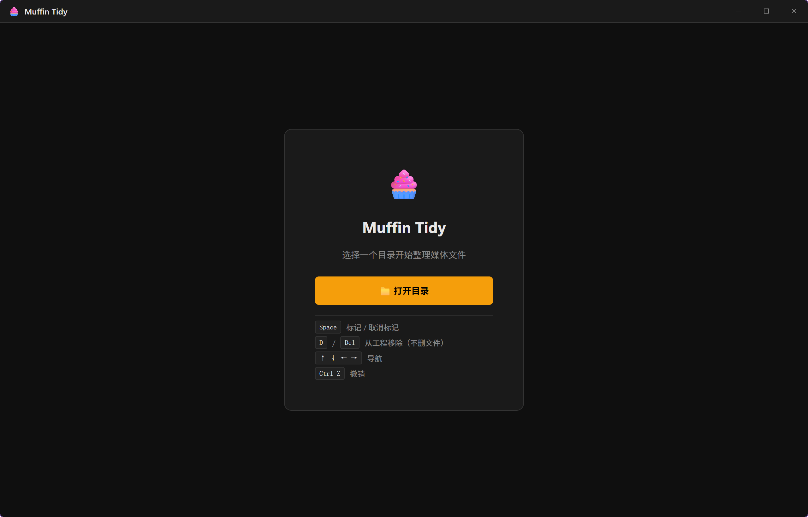
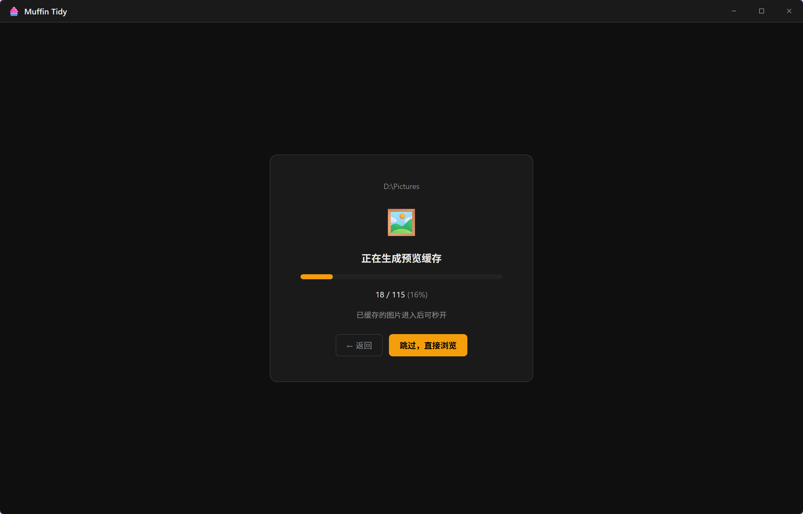
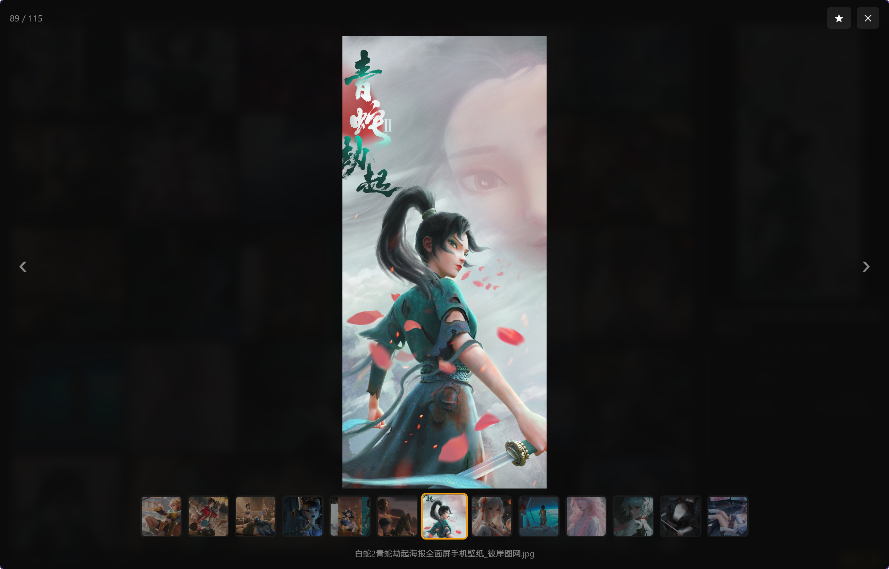
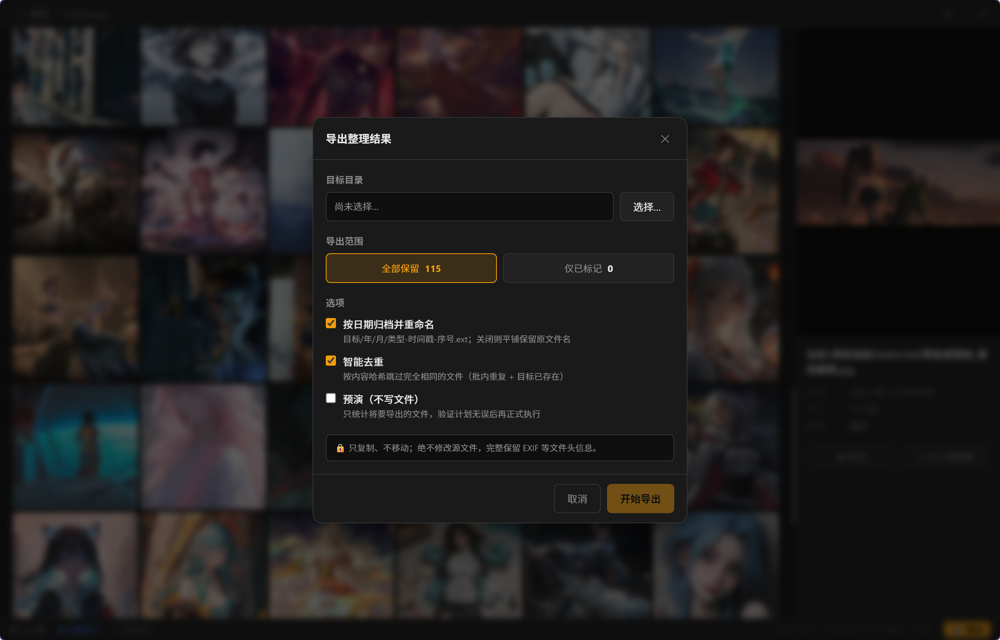

<div align="center">


# Muffin Tidy · 媒体文件整理工具

**一款 Windows 优先的照片 / 视频「快速筛选 · 去芜存菁」桌面应用**

扫描目录 → 智能识别媒体与 Live Photo → 键盘极速汰选 → 安全导出留存

<br/>


</div>

---

## ✨ 这是什么

整理几千张手机相册时，最痛苦的不是删除，而是**逐张判断该留还是该弃**。Muffin Tidy 把这个流程做成了一条顺滑的流水线：

> 选目录 → 递归扫描分类、自动配对 Live Photo → 在虚拟化网格里用键盘飞快标记/剔除 → 一键安全导出保留下来的精华。

整个汰选过程**只在工作集里增删，绝不触碰源文件**；导出阶段也只做**只读复制**，源目录永远安全。

<div align="center">
  
</div>

---

## 🎬 功能速览

<table>
  <tr>
    <td width="50%"></td>
    <td width="50%"></td>
  </tr>
  <tr>
    <td align="center"><b>递归扫描 · 智能分类</b><br/>图片 / 视频 / Live Photo 自动归类</td>
    <td align="center"><b>虚拟化网格 · 键盘汰选</b><br/>上万张图片也能流畅滚动</td>
  </tr>
  <tr>
    <td width="50%"></td>
    <td width="50%"></td>
  </tr>
  <tr>
    <td align="center"><b>大图浏览 · 细节预览</b><br/>2048px 高清预览，独立键盘操作</td>
    <td align="center"><b>Live Photo 配对播放</b><br/>iOS / 华为 / 安卓动态照片全支持</td>
  </tr>
  <tr>
    <td colspan="2"></td>
  </tr>
  <tr>
    <td colspan="2" align="center"><b>安全导出 · 审计留痕</b><br/>按 <code>年/月/类型</code> 归档复制，自动去重，并写入导出日志</td>
  </tr>
</table>

---

## 🚀 核心特性

### 📂 智能扫描与分类
- 递归遍历目录（自动跳过隐藏文件），按扩展名分类为 **图片 / 视频 / Live Photo**
- 读取拍摄时间与精简 EXIF 信息
- **Live Photo 自动配对**：将一张照片与它的动态视频融合成单条记录
  - 优先使用 iOS `ContentIdentifier`（EXIF `0x9999` / `apple-fi`）精确配对
  - 同目录同名兜底：`.mov` → Apple，`.mp4` → 华为
  - 安卓 Motion Photo：MP4 内嵌于 JPEG 中，通过 `MicroVideoOffset` 字节偏移读取

### ⚡ 高性能缩略图引擎（Rust）
- **320px 缩略图 / 2048px 预览**，按 `路径 + 修改时间` 落盘缓存（源文件一改，缓存自动失效）
- 多级解码兜底：JPEG 走 DCT 降采样快速路径 → 通用格式走 `image` 库 → **HEIC / RAW 走 Windows WIC** → 视频首帧走 Windows Shell → 兜底灰图（永不出现破图标）
- 全局信号量限流（最多 4 并发），滚动时不会冲垮后端

### ⌨️ 键盘驱动的汰选体验
| 快捷键 | 作用 |
| :---: | :--- |
| `↑` `↓` `←` `→` | 在网格中移动焦点 |
| `空格` | 标记 / 取消标记当前文件 |
| `D` / `Delete` | 从工作集中剔除（**不删除磁盘文件**） |
| `Ctrl + Z` | 撤销上一步状态变更 |
| `E` | 打开导出对话框 |
| `Ctrl/⌘ + 滚轮` | 无级缩放缩略图大小 |

> 文件状态分为 `正常 / 已标记 / 已剔除`。「剔除」只是移出工作集，**源文件始终安然无恙**。

### 🛡️ 安全导出（绝不破坏源数据）
导出会把保留的文件**复制**到目标目录，按 `目标/YYYY/MM/{Img|Vdo|Lpo}-时间戳-序号.ext` 归档（可关闭归档改为平铺复制）。Rust 侧强约束、单元测试覆盖的安全不变量：

- **绝不写入源树**：拒绝目标 == 源、目标在源内、源在目标内
- **绝不覆盖**：仅 `std::fs::copy` 复制，目标已存在则用序号另寻空位
- **完整保真**：字节级复制保留所有头信息（EXIF / XMP / 容器），并用 `filetime` 还原修改/访问时间
- **SHA-256 去重**：批内去重 + 目标冲突跳过
- **审计留痕**：每次正式导出在目标根目录写入 `muffin-tidy-export-{时间戳}.log`，逐条记录 `[导出] / [重复] / [冲突] / [失败]`

---

## 🧱 技术架构

```
┌─────────────────────────────┐         ┌──────────────────────────────┐
│        前端 (src/)           │  IPC    │      后端 (src-tauri/src/)    │
│  Vue 3 + Pinia + Tailwind v4 │ ◄─────► │        Rust + Tauri 2        │
│                              │ invoke  │                              │
│  • ThumbnailGrid (virtua)    │         │  • scanner.rs   扫描/配对     │
│  • Lightbox 大图浏览          │         │  • thumb.rs     缩略图/预览   │
│  • ExportDialog 导出          │         │  • livephoto.rs XMP/EXIF 解析 │
│  • Pinia 单一状态机           │         │  • export.rs    安全导出      │
└─────────────────────────────┘         └──────────────────────────────┘
        无 vue-router，App.vue 按 phase 枚举切换视图
   idle → scanning → preloading → ready 驱动整个界面流转
```

**技术栈**：Tauri 2 · Vue 3 `<script setup>` · Pinia · Tailwind v4 · TypeScript · Vite

> **Windows 解码是关键依赖**：HEIC / RAW（WIC）与视频首帧（Shell）均为 `#[cfg(windows)]` 实现，依赖 COM/MTA。非 Windows 平台这些格式会直接回退到灰图占位。

---

## 🛠️ 开发与构建

> `tauri.conf.json` 将 `bun run dev` / `bun run build` 硬编码为生命周期钩子，因此 **PATH 上需要有 `bun`**；Tauri CLI 本身可用任意包管理器调用。

| 命令 | 说明 |
| :--- | :--- |
| `bun run tauri dev` | 启动完整应用（Vite 1420 端口 + 原生窗口，双端热重载） |
| `bun run dev` | 仅前端（浏览器，1420 端口），多数后端能力不可用 |
| `bun run tauri build` | 打包各平台安装包 |
| `bun run build` | 类型检查门禁：`vue-tsc --noEmit && vite build` |
| `cargo check` / `cargo build` | 在 `src-tauri/` 内做 Rust 侧检查 |

```bash
# 克隆后首次运行
bun install
bun run tauri dev
```

> ⚠️ 当前**尚未接入测试框架**，`bun test` / `cargo test` 暂无实际用例。

---

## 📁 目录结构

```
muffin-tidy-app/
├─ src/                       # Vue 前端
│  ├─ components/             # ThumbnailGrid / Lightbox / ExportDialog / TitleBar ...
│  ├─ composables/            # useKeyboard / useThumbQueue ...
│  └─ stores/project.ts       # 单一 Pinia 状态机（全应用状态）
├─ src-tauri/src/             # Rust 后端
│  ├─ lib.rs                  # 注册命令 / 插件 / mtidy-mphoto 协议
│  ├─ scanner.rs              # 扫描 + Live Photo 配对
│  ├─ livephoto.rs            # XMP/EXIF 字节级解析
│  ├─ thumb.rs                # 缩略图 / 预览 + 磁盘缓存
│  └─ export.rs               # 安全导出 + 审计日志
└─ img/                       # 文档示意图
```

---

<div align="center">

由 🦀 Rust + 💚 Vue 强力驱动 · 仅整理，不破坏

</div>
