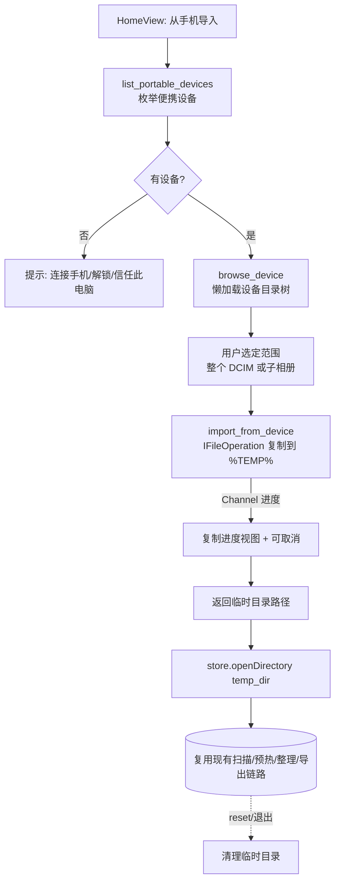

# 手机直连导入（MTP）详细设计

> 方案 B：Shell COM 枚举 + 复制到临时目录再扫描
> 状态：设计稿（待评审 → 进入阶段 0 PoC）
> 关联代码：`src-tauri/src/scanner.rs`、`src-tauri/src/thumb.rs`、`src/views/HomeView.vue`、`src/stores/project.ts`

## 1. 背景与目标

当前 Muffin Tidy 只能整理「本地文件系统目录」。用户希望把 USB 直连的手机（iPhone / 安卓）相册直接拿进来整理，目前**完全不可用**。

目标：在不重构现有扫描 / 缩略图 / 导出核心的前提下，新增一条「便携设备 → 本地临时目录 → 现有扫描链路」的导入通道，统一覆盖 iPhone 与安卓。

## 2. 根因复盘（为什么现在不行）

手机经 USB 连入 Windows 走的是 **MTP/PTP（便携设备）协议**，在两处被卡死：

| 阻断点 | 现状 | 说明 |
|---|---|---|
| **选不中** | `HomeView.vue` → `open({ directory: true })` | 手机在资源管理器是 Shell 虚拟命名空间（`此电脑\Apple iPhone\Internal Storage\DCIM`），**无盘符、无 Win32 路径**。文件夹选择器只接受真实文件系统目录。 |
| **读不到** | `scanner::scan` 用 `walkdir` + `std::fs` | MTP 内容只能走 WPD COM / Shell 接口，`std::fs::metadata`/`File::open`/`MediaSource::file_path` 全部够不着。 |

→ 结论：非参数/权限可解，必须新增便携设备访问通道。

## 3. 方案选型（为什么选 B）

| 方案 | 思路 | 覆盖 | 工作量 | 取舍 |
|---|---|---|---|---|
| A 引导导入 | UI 提示用户先手动复制到本地 | 全 | 极小 | 非真·直连 |
| **B 枚举+复制（选定）** | Shell COM 枚举 DCIM → 复制到 `%TEMP%` → 复用现有扫描 | iPhone+安卓 | 中 | MTP 传输慢、占临时空间 |
| C WPD 原生直读 | `IPortableDevice` 不落地直读，重构 scanner 路径假设 | iPhone+安卓 | 大 | 最正宗但风险最高 |
| D libimobiledevice | AFC 直读 iPhone | 仅 iPhone | 大 | 单平台 + 需打包 Apple 驱动 |

**选 B 的核心理由**：文件复制到本地临时目录后即为真实路径，下游 `scanner.rs` / `thumb.rs` / `export.rs` **零改动**即可工作；且复用代码库已有的 `windows` crate MTA COM 范式（[thumb.rs:157](../../src-tauri/src/thumb.rs)），不引入新技术栈。

## 4. 总体流程



## 5. 后端详细设计

### 5.1 新模块 `src-tauri/src/portable.rs`（全 `#[cfg(windows)]`）

承载便携设备枚举与复制。非 Windows 下命令返回空列表 / 明确错误，前端隐藏入口。

### 5.2 设备枚举

1. `SHGetKnownFolderItem(FOLDERID_ComputerFolder)` 拿到「此电脑」`IShellItem`。
2. `BindToHandler(BHID_EnumItems)` → `IEnumShellItems` 遍历子项。
3. 用 `IShellItem::GetAttributes` 区分：便携设备通常 `SFGAO_FILESYSTEM == false` 且 `SFGAO_STORAGE` / `SFGAO_STORAGEANCESTOR == true`，借此过滤掉本地盘符。
4. 每个设备的标识用其 **parsing name**（`SIGDN_DESKTOPABSOLUTEPARSING`）回传——可被 `SHCreateItemFromParsingName` 反解，作为后续 `browse/import` 的句柄。

### 5.3 目录树浏览（懒加载）

`browse_device(parent_id)`：`SHCreateItemFromParsingName(parent_id)` → `BHID_EnumItems` 列出子项，返回 `{ id, name, kind: folder|file }`。前端按需展开，避免一次性枚举整机（MTP 枚举慢）。

### 5.4 复制到临时目录（核心）

- 目标：`%TEMP%/mtidy-import/<session-id>/`（`session-id` 用时间戳，隔离多次导入）。
- 用 **`IFileOperation`**：
  - `CoCreateInstance(FileOperation)` → `SetOperationFlags(FOF_NO_UI | FOFX_NOCOPYHOOKS)`。
  - 对每个选定 `IShellItem` 调 `CopyItem(src, dst_folder, new_name, sink)`，最后 `PerformOperations()`。Shell 自动处理 MTP → 本地字节流与子目录递归。
  - 进度：实现 `IFileOperationProgressSink`（`PostCopyItem` 等回调）→ 经 Tauri `Channel` 上报前端。
- **⚠ 套间模型**：`thumb.rs` 现有路径用 **MTA**；而 `IFileOperation` 官方要求 **STA（单线程套间）**。复制须跑在**专用 STA 线程**（`CoInitializeEx(None, COINIT_APARTMENTTHREADED)`），不要复用 MTA。这是本设计最易踩的坑，PoC 必须先验证。
- 取消：`IFileOperationProgressSink` 返回 `E_ABORT` 或调用 `IFileOperation` 的中止；前端「取消」按钮经一个 `AtomicBool` 透传。

### 5.5 临时目录生命周期

- `store.reset()`（[project.ts:205](../../src/stores/project.ts)）与应用退出时清理 `mtidy-import/<session>`。
- 导出（`export.rs`）是 copy 语义：从临时目录复制到用户正式目标后，临时目录可安全删除，不影响产物。

### 5.6 新增 Tauri commands（`lib.rs` 注册）

```rust
list_portable_devices() -> Result<Vec<PortableDevice>, String>
browse_device(parent_id: String) -> Result<Vec<DeviceEntry>, String>
import_from_device(item_ids: Vec<String>, on_progress: Channel<ImportProgress>)
    -> Result<String /*temp_dir*/, String>   // async + spawn_blocking
cancel_import()  // 或经 import 句柄
```

### 5.7 `Cargo.toml` 的 `windows` features 增量（待 PoC 校准）

现有：`Win32_UI_Shell`、`Win32_System_Com`、`Win32_Storage_FileSystem`、`Win32_Foundation`。
预计新增：`Win32_UI_Shell_Common`、`Win32_System_Com_StructuredStorage`（PROPVARIANT/PKEY），以及启用 `implement` 宏以实现 `IFileOperationProgressSink`。具体以 `cargo check` 为准。

## 6. 前端详细设计

### 6.1 入口与视图

- `HomeView.vue`：在「📁 打开目录」旁新增「📱 从手机导入」按钮（`#[cfg(windows)]` 才显示，可用 `platform()` 判断）。
- 新增视图 `src/views/DeviceImportView.vue`：设备列表 + 目录树（懒加载）+ 范围选择 + 「开始导入」。
- 复制进度复用 `PreloadView.vue` 的进度条样式，或新增轻量进度态。

### 6.2 store 改造（`stores/project.ts`）

- phase 状态机扩展：`idle → importing → scanning → preloading → ready`（`importing` 期间显示复制进度）。
- 导入完成拿到 `temp_dir` → 直接调用现有 `openDirectory(temp_dir)`，**下游完全复用**。
- `reset()` 增加：若来源是临时导入目录，触发后端清理命令。

### 6.3 数据契约（snake_case ↔ camelCase，沿用现有约定）

```ts
interface PortableDevice { id: string; name: string }
interface DeviceEntry { id: string; name: string; kind: "folder" | "file" }
interface ImportProgress { done: number; total: number; current_name: string }
```

## 7. 与现有链路的衔接（零改动论证）

| 关注点 | 复制后是否可用 | 说明 |
|---|---|---|
| 扫描遍历 | ✅ | 临时目录是真实路径，`walkdir`/`std::fs` 直接可用 |
| 拍摄时间/EXIF | ✅ | MTP 复制为字节精确拷贝，EXIF/XMP 完整保留 |
| HEIC/RAW 解码 | ✅ | 落地后走现有 WIC 链路 |
| iOS Live Photo 配对 | ✅ | iPhone MTP 暴露同 stem 的 `IMG_xxxx.HEIC` + `.MOV`，策略 1（ContentIdentifier）/ 策略 2（同名回退）均生效 |
| 安卓 Motion Photo | ✅ | 单 JPG 内嵌 MP4，复制后 `read_xmp_data` + `mtidy-mphoto://` 照常 |
| 导出 | ✅ | export 为 copy 语义，从临时目录复制到正式目标 |

## 8. 关键风险与对策

| # | 风险 | 对策 |
|---|---|---|
| 1 | **无真机无法验证** | 阶段 0 PoC 必须真机在场（开发机无法插手机自测）；先跑通枚举+复制 1 个文件再展开 |
| 2 | iPhone 未解锁 / 未「信任此电脑」→ DCIM 空或设备隐身 | 明确错误提示与重试引导 |
| 3 | 套间模型：IFileOperation 需 STA，与现有 MTA 冲突 | 复制跑专用 STA 线程，PoC 优先验证 |
| 4 | MTP 传输慢、大相册几十 GB | 进度 + 取消 + 范围选择（先选子相册，非全机） |
| 5 | 临时磁盘空间不足 | 复制前检查 `%TEMP%` 所在盘可用空间，不足则提示 |
| 6 | 非 Windows 平台 | 整模块 `#[cfg(windows)]`，前端隐藏入口 |

## 9. 任务拆解（分阶段）

- **阶段 0 — PoC（需真机，先行验证）**
  - `poc_list_devices`：枚举便携设备返回名称列表。
  - `poc_copy`：把指定设备的某文件夹复制到 `%TEMP%`，验证 STA + IFileOperation 通路。
  - 出口判据：真机上能列出设备、能复制出至少 1 张可被现有扫描识别的照片。
- **阶段 1 — 后端核心**：`portable.rs`（枚举/浏览/复制+进度/取消）+ 临时目录管理 + 命令注册 + features 校准。
- **阶段 2 — 前端**：导入入口 + `DeviceImportView` + 进度态 + 接回 `openDirectory`。
- **阶段 3 — 健壮性**：错误提示（无设备/未信任/空）、取消、空间检查、临时清理钩子、非 Windows 降级。
- **阶段 4 — 增强（可选）**：按拍摄时间 / 选中项过滤，规避全量复制。

## 10. 验证计划（强依赖真机）

| 场景 | 设备 | 预期 |
|---|---|---|
| 设备枚举 | iPhone + 安卓各一 | 名称正确出现，本地盘符不混入 |
| 解锁/信任态 | iPhone 锁屏 vs 解锁信任 | 锁屏给提示，信任后可见 DCIM |
| 复制+扫描 | 含 Live Photo / Motion Photo 的相册 | 复制完整、配对正确、缩略图正常 |
| 取消 | 大相册复制中途 | 可中止、临时目录被清理 |
| 导出 | 从临时目录导出到正式目标 | 产物完整，临时目录可清 |

---

## 11. PoC 验证结果（2026-06-21，iPhone 真机）

阶段 0 PoC **全部通过**，方案 B 端到端可行性确认：

- ✅ **设备枚举**：iPhone 正常出现在「此电脑」下，可下钻 `Apple iPhone → Internal Storage → DCIM`。
- ✅ **跨调用句柄（关键坑）**：MTP 内部对象**必须用 PIDL**——初版用 `SIGDN_DESKTOPABSOLUTEPARSING` 字符串 + `SHCreateItemFromParsingName` 反解，在 `Internal Storage` 层即 `E_INVALIDARG (0x80070057)`；改为 `SHGetIDListFromObject` 取 PIDL → hex 序列化 → `SHCreateItemFromIDList` 反解后通过。
- ✅ **STA + IFileOperation 复制**：专用 STA 线程复制成功，**53 个文件 / 1.56 GB** 从 MTP 落地本地。
- ✅ **文件完整 & Live 配对可行**：复制出 `IMG_xxxx.HEIC` + `IMG_xxxx.MOV` **同名成对**（26 HEIC / 27 MOV），现有 `pair_live_photos` 策略 2（同名回退）即可配成 Apple Live；HEIC 走现有 WIC 解码。**「下游零改动」论证成立。**

### 待办（阶段 1 处理）
- ⚠ **`openPath` 打开目录无反应**：疑似 opener 插件 scope 未覆盖目标路径；**同一 API 也用于 `ExportDialog` 的「打开目标目录」/日志，可能是既有隐患**，阶段 1 一并定位（配 opener scope 或改用 Rust 端 reveal）。

---

## 12. 阶段 1 落地记录（2026-06-23）

PoC 正式化为 `portable.rs` 后，本轮补齐健壮性四项（均通过 `cargo check` 与 `bun run build`）：

### 12.1 复制可取消（`IFileOperationProgressSink`）
- 用 `#[implement(IFileOperationProgressSink)]` 实现进度回调，**仅在 `PreCopyItem` 检查取消标志 → 返回 `E_ABORT`**。进度仍由原轮询监控线程负责，sink 只管取消，COM 面最小。
- 微软文档确认契约：`PreCopyItem` 返回任意错误码即取消整批操作及后续操作；且取消后 `PerformOperations` **可能仍返回成功码**。
- 取消判定**只认进程内 `IMPORT_CANCEL` 原子标志**（由 `pd_cancel_import` 置位、每次导入开头复位）——不用 `GetAnyOperationsAborted`，因为磁盘满等"系统中止"也会置 aborted，会把真实失败误判成取消。
- `ImportResult` 增 `cancelled` 字段；取消时后端 `remove_dir_all` 半成品临时目录并静默返回，前端据此回到浏览态。新增命令 `pd_cancel_import`。
- ⚠ 技术坑：windows 0.61 的 `#[implement]` 宏展开引用裸 `windows_core` 路径，需把 `windows-core` 列为**直接依赖**（伞 crate `windows` 不够）。`windows` 本身**无 `implement` feature**（该宏无 feature 开关）。

### 12.2 `openPath` 打开路径修复（§11 待办闭环）

> ⚠ 2026-06-25 订正：本节初版「非 scope 问题 / 对文件正常」的判断有误，已据 opener 2.5.4 源码与真机报错串更正如下。§11 当时的 scope 假设其实是对的。

- 真正根因：**确是 opener 作用域问题**。`opener:allow-open-path` 只“启用 open_path 命令、无预配置作用域”，即 path 允许列表为**空集**；`opener:default` 只引入 URL 作用域（mailto/tel/http/https），不含任何 path 条目。opener 2.5.4 的 `Scope::is_path_allowed`（`src/scope.rs`）返回 `fs_scope.is_allowed(path) && self.allowed.iter().any(..)`——后半个 `any()` 在 allow 为空时**恒为 `false`**，故 `open_path` 对**任何路径**（文件与目录一视同仁）都返回 `ForbiddenPath("Not allowed to open path …")`。PoC 当时打开目录的报错正是此串；“对文件正常”从未真正成立——`ExportDialog` 的「打开日志」按钮同样被静默拒绝，错误被空 `catch` 吞掉，表现为“点了没反应”。
- 方案（统一改走 Rust，绕过空作用域）：
  - 目录：Rust 命令 `reveal_path`，Windows `explorer <dir>`（成功退出码也可能非 0，故只 spawn 不校验）。`ExportDialog`「打开目标目录」用它。
  - 文件（日志）：新增 Rust 命令 `open_path_default`，直接调插件的 `OpenerExt::open_path`（该 **Rust 接口不经过** IPC 命令层的 ACL 作用域校验，用系统默认程序打开 .log）。`ExportDialog.openLog()` 改调它，并**去掉静默 catch**（失败 `alert` 提示）。
  - capabilities：JS 侧 `open_path` 命令已无人调用，移除死权限 `opener:allow-open-path`（保留 `opener:default`）。自定义命令不走 opener ACL，故无需为其配置作用域——这一句原文成立。
- 备选未采用：给 `opener:allow-open-path` 配 `{ "allow": [{ "path": "**" }] }` 作用域。可行但把“打开任意路径”能力暴露给前端（最小权限更差），且导出目标为运行时任选、静态作用域难以精确限定，故选 Rust 命令方案。

### 12.3 错误细化
- `friendly_copy_error()` 映射 HRESULT：磁盘满（`0x80070070/27`）/ 未解锁未信任（`E_ACCESSDENIED 0x80070005`）/ 设备掉线 → 中文提示，其余原样带码。

### 12.4 临时目录生命周期
- `run()` 启动即清扫 `%TEMP%/muffin-tidy-import`（保留 `reset()` 的当次清理）。启动清扫比退出钩子更稳：崩溃/强退残留也能清。

### 仍待处理
- 进度粒度仍为轮询（200ms），未改用 sink 的 `PostCopyItem` 精确上报——非本轮范围。

> PoC 已移除（2026-06-25）：PoC 面板真机验证通路成功（单次复制 1842 文件），与正式入口底层同源。经确认删除 `poc.rs`、`PoCDevicePanel.vue` 及 `lib.rs`/`HomeView.vue` 的全部引用；正式「📱 从手机导入」入口（`portable.rs`/`DeviceImportView.vue`）为其严格超集。
